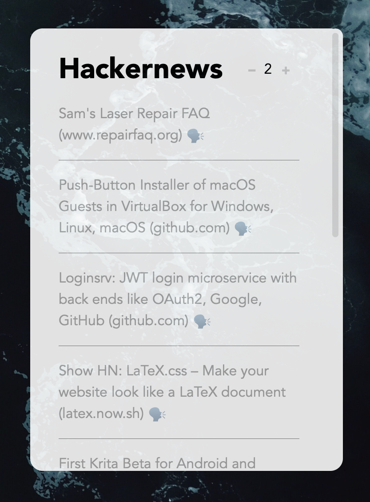

## A Hacker News Top Stories widget for Übersicht

[http://tracesof.net/uebersicht/](http://tracesof.net/uebersicht/)

### Installation

Add the extracted widget to your widgets folder.

### Übersicht, Accessibility, and clicking links

Übersicht has a preference for an Interaction Shortcut that allows widget elements to be clicked while holding a configured modifier key. Out of the box, Übersicht doesn't ask for Accessibility access, so this preference doesn't appear to work at first. Add Übersicht to the list of apps in System Preferences > Security & Privacy > Privacy > Accessibility in order for this to work as expected.

Once the Interaction Shortcut is allowed and configured, the story titles and discussion links are clickable and will open in your default browser.

### Prior Art
Note that this was originally created by [tupton](https://github.com/tupton/uebersicht-hacker-news). I simply updated the styles to my liking and added pagination, as well as a link to Hackernews itself (the header). This distribution is not posted in the Uebersicht widget gallery. 